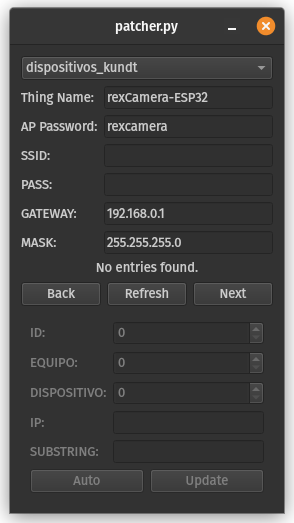
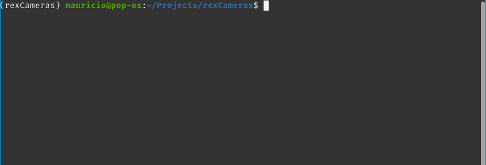
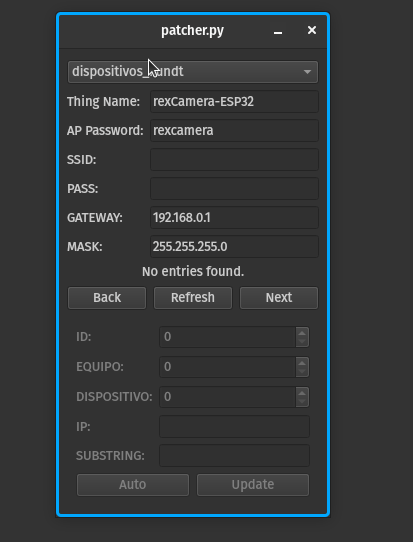
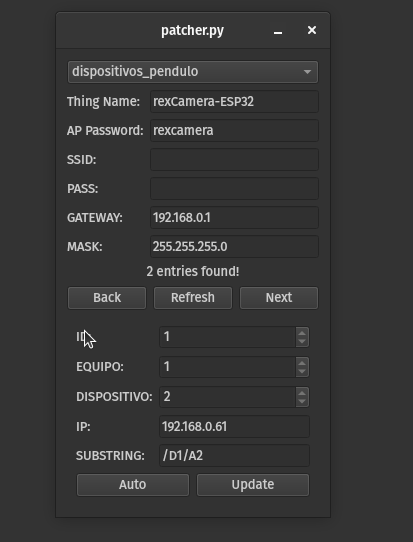
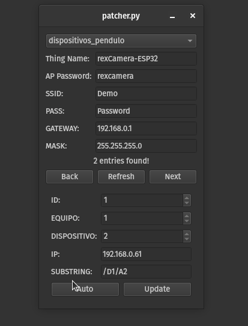
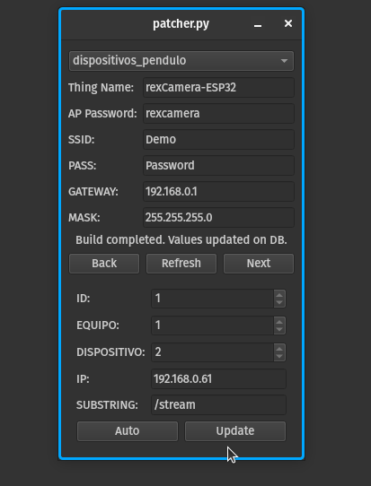

# rexCameras: A simple tool to program the ESP32-based cameras for the remote experiments.



## How it works

The program connects directly to the tables for the camera devices of the experiments, from there it retrieves all the entries and loads them onto the program. Using the information of an existing camera, the information can be completed with the new parameters for the new firmware: name, ap-password, ssid and password of the WiFi network of the lab, aswell, as the gateway and mask. These parameters are converted onto a JSON file inside the `/data` folder of the firmware. This configuration JSON is used to initialize the defaults of the device, allowing for easy batch programing of the devices, by generating a filesystem image that is burned onto the ESP32 memory space. 

The tool also burns the new firmware based on the following project: https://github.com/rzeldent/esp32cam-rtsp/. 

From the interface, the information of the camera can also be modified, by changing the retrieved entry directly. After the process of burning the filesystem and firmware is done, all changes are passed onto the database. 

By default the camera is configured with the following defaults values:

| Parameter | Default Value | 
|-----------|---------------|
|Thing Name | rexCamera-ESP32|
|AP Password | rexcamera |
| Frame duration | 10ms | 
| Frame size | HD (1280x720)|
| Quality JPEG | 14 |

The first two defaults can be changed directly from the tool, but can also be changed from the internal HTML interface of each camera. The camera parameters can only be modified from the HTML interface. 

## Installation

In the following section, detailed instrucctions on how to install the tool and its dependencies are provided. 

### Dependencies

- **This repo:** Clone this repo into a folder
```bash
git clone git@github.com:DopamineLabsLTDA/rexCameras.git
```

- **Firmware:** The custom fork of rzeldent's project must be cloned onto a folder (can be a subfolder of this repo)
```bash 
git clone git@github.com:DopamineLabsLTDA/esp32CamFirmware.git
```
**Notice: It must be this tailored version of the firmware. The fork is implemented to make use of the IotWebConf library JSON loader functionality to provide default values during the compilation of the firmware. The original project doesn't include this changes.**

- **Python dependencies:** `Pipfile`s and `requirements.txt` files are provided for both **Pipenv** and **pip** installations. Select one of these installations methods.
  - Pipenv: Run the following commmand from inside the root folder of this repo. 
    ```bash
    pipenv shell
    ```
  - pip:
    ```bash
    pip -r requirements.txt
    ```

- **Network connectivity:** You must be on the same network as the backend. This is to provide access to the database. 

## Usage




To test if the tool was correctly setup, you can run the following command: 
```bash
python patcher.py -h 
```

Resulting in the options of the script being displayed:
```
usage: patcher.py [-h] --db-url DB_URL --db-name DB_NAME --db-user DB_USER --db-pass DB_PASS
                  [--db-port DB_PORT] --firmware FIRMWARE --config-json CONFIG_JSON

A simple patcher program for the esp32 based cameras.

options:
  -h, --help            show this help message and exit
  --db-url DB_URL       The database URL.
  --db-name DB_NAME     The database name
  --db-user DB_USER     The database username
  --db-pass DB_PASS     The database username password
  --db-port DB_PORT     The port on which the database is attached
  --firmware FIRMWARE   Folder of the firmware for the camera
  --config-json CONFIG_JSON
                        The config file for the system memory

```

**To launch the tool:** You need to provide the following arguments
| Arguments | Description | 
|-----------|-------------|
| `--db-url` | The URL for the database. In this case `192.168.0.100`|
| `--db-name` | The name for the database. `db-labfis`| 
| `--db-user` | The username to access the database. | 
| `--db-pass` | The password for the username. | 
| `--db-port` | The port on which the DB controller is listening. `5432`| 
| `--firmware`| The path to the folder with the firmware.|
| `--config-json`| The path inside the firmware folder, where the configuration json is stored. | 

**Example command to launch the tool:**
```bash
python --db-url 192.168.0.100 --db-name db-labfis --db-user USERNAME --db--pass PASWORD --db-port 5432 --firmware ./esp32CamFirmware --config-json ./esp32CamFirmware/data/config.json
```

Replacing the fields USERNAME and PASSWORD with the provided ones. After runing the example line you should be greeted with the following interface for the tool: 


On the top part, the dropdown menu allows you to select from the four different tables for the available cameras on the platform: Kundt, Pendulo, Venturi and Estanque. By selecting one of these tables, the interface updates and shows the number of entries found and displays the first available one (by id): 



Below the table dropdown menu, there are fields for the common parameters:

| Parameter | Description | 
|-----------|-------------|
|Thing Name | The name for the device. Can be leaved as default.|
| AP Password | The password for the Access Point (AP) that is setup when there are no valid configuration. This password is also used for further settings on the HTML interface. Can be leaved as default. |
| SSID | The name of the WLAN to connect the camera to.|
| Pass | The password for the WLAN.|
| Gateway | The default gateway for the connection. **For this case, leave as default.**|
| MASK | The default subnet mask for the connection. **For this case, leave as default.**|



Below this fields, three buttons can be found, back and next allow to rotate between each of the db entries for the specified table. The refresh button re-fills the entry-fields with the values from the db-entry.

Below these controls, there are the entry fields, they contain the info that is shared between the device and the DB. **Mainly change the IP (if necessary) and change the subtring. By pressing the auto button, the subtring is change by default to the new value `/stream`**



After performing this operation, you should be able to flash the filesystem, firmware and update the DB by pressing the `UPDATE` button. (The camera needs to be connected via USB at this point.)

The error catching during this process is kind of limited, but some messages indicate what could have go wrong, in this case, the filesystem failed to load to the ESP (because it was not connected to the PC):




At this point if everything went wright, the camera is ready, you can check on this by waiting a few moments for the camera to initialize and the connecting directly to the IP programed from a navigator and be greeted with the following page:


This is the HTML interface for the cameras, allows to check the state and control some configurations, by pressing the `Change Settings` button and providing the admin/ap_password (rexcamera by default) as credentials. From that interface the WiFi, static IP, gateway, dns and a lot of camera configurations can be tuned. 

In this page the stream can also be checked from the links at the bottom of the page. 


### WiFi Error during configuration: 

If you provide incorrect credentials or the WLAN is not available and you need to migrate/change some configuration of the camera, this is still posible. After three failed attemps to connect, the camera will default to setup an AP, that you can connect and change settings directly from the HTML interface. 
